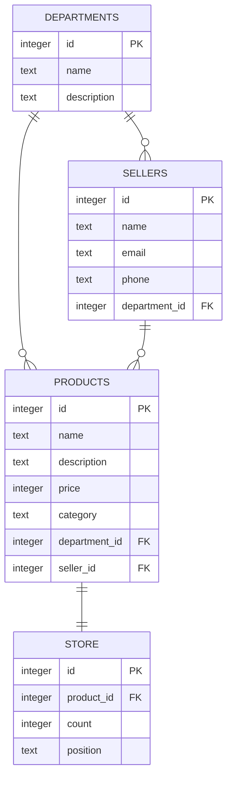

# Shop project

### Use: NodeJS -v 20.19, EJS, SQLite3 -v 3.46

### Структура проекта:
```
├── init.sql            => скрипт миграции БД
├── Makefile            => команды для make
├── package.json
├── package-lock.json
├── Readme.md
├── shop.db             => локальная БД (создается при инициализации БД)
└── src                 => source-директория со всеми файлами программного кода
    ├── app.js          => главный файл приложения
    ├── models          => ORM
    ├── routes          => API-роуты 
    ├── static          => статика
    └── views           => шаблоны EJS
```



### Описание Makefile:
- init-db: инициализация БД `shop.db` *(если в корне уже есть БД, она удаляется и создается новая, осторожно!)*
- install: установка NPM-зависимостей:
    - ejs
    - express
    - method-override
    - sequelize
    - sqlite3
- run: запуск приложения `src/app.js`

**Планы:**
- [x] Заняться БД
- [x] Сделать ORM
- [x] Сделать API
- [x] Добавить базовые шаблоны
- [ ] Сделать единый стиль для всех шаблонов EJS
- [ ] Добавить Dockerfile
